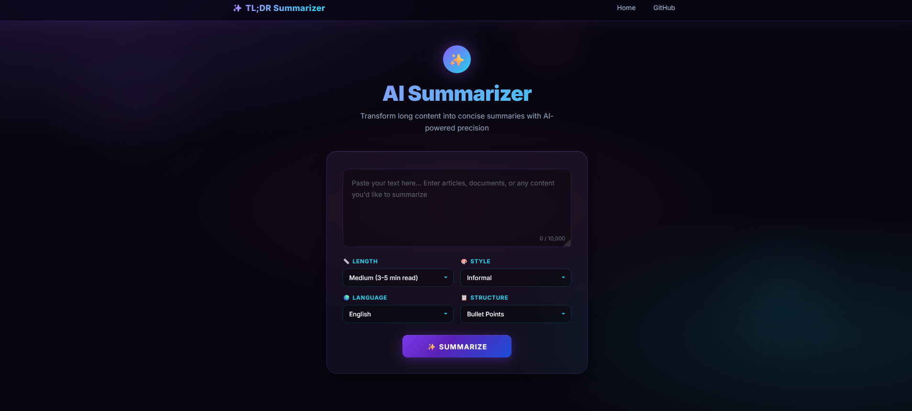

# tldr-llm

**tldr-llm** is a lightweight LLM-powered web application that generates customizable **TL;DR summaries** from long-form text.  
Users control summary **length**, **style**, **language**, and **structure** through a modern glassmorphism UI.

---

## Live Demo

👉 https://summarizer-web-app.onrender.com/

## Repository

👉 https://github.com/Maharavan/tldr-llm

---

## Features

- Generate concise **TL;DR summaries** from long text (up to 10,000 characters)
- Customize **summary length** — Short · Medium · Long
- Choose **summary style** — Formal · Informal · Technical
- Select **output language** — English · Spanish · French
- Control **summary structure** — Bullet Points · Paragraph · Numbered List
- Copy to clipboard and download summary as `.txt`
- Responsive, mobile-friendly UI
- Single-route Flask backend with prompt-driven LLM calls

---

## How It Works

1. User pastes long-form text into the input area.
2. User selects preferences — length, style, language, structure.
3. Flask backend builds a structured prompt from the inputs.
4. Prompt is sent to **Groq** (`llama-3.3-70b-versatile`) via the Groq API.
5. The generated summary is rendered on the result page.

---

## Tech Stack

| Layer       | Technology                          |
|-------------|-------------------------------------|
| Backend     | Python · Flask                      |
| LLM         | Groq API (`llama-3.3-70b-versatile`)|
| Frontend    | HTML · CSS (glassmorphism + Inter)  |
| Container   | Docker                              |
| CI/CD       | GitHub Actions                      |
| Deployment  | Render                              |

---

## Project Structure

```
tldr-llm/
├── app.py                        # Flask app & routes
├── llm.py                        # Groq API integration
├── prompts.py                    # Prompt templates
├── templates/
│   ├── tldm/
│   │   ├── base.html             # Base layout
│   │   ├── home.html             # Input form page
│   │   └── summarize_result.html # Result page
│   └── static/
│       └── css/
│           └── style.css         # UI styles
├── requirements.txt
├── Dockerfile
└── README.md
```

---

## Run Locally

### 1. Clone the repository
```bash
git clone https://github.com/Maharavan/tldr-llm.git
cd tldr-llm
```

### 2. Install dependencies
```bash
pip install -r requirements.txt
```

### 3. Set environment variables

Create a `.env` file in the project root:
```env
GROQ_API_KEY=your_groq_api_key_here
```

Get a free API key at [console.groq.com](https://console.groq.com).

### 4. Start the application
```bash
python app.py
```

Visit `http://localhost:5000` in your browser.

---

## Docker

```bash
docker build -t tldr-llm .
docker run -p 5000:5000 -e GROQ_API_KEY=your_key tldr-llm
```

---

## UI

<p align="center">
  
</p>

---
